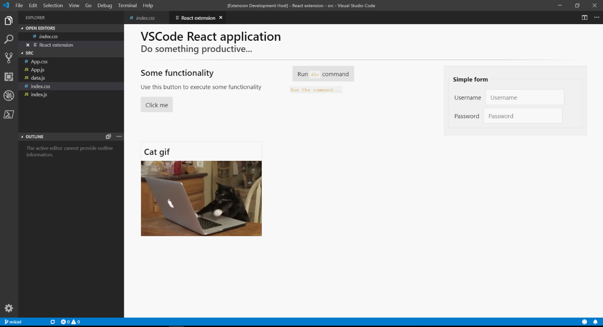

# VSCode React extension sample

Sample of a VSCode extension using React.

This uses the WebView API for VSCode to create a visual extension using plain React for the front end.

The VSCode extension integration sits at the top, with the react application living in a folder below it. Note they have separate `package.json` files.

The React application is designed to be decoupled from VSCode, so it can be debugged and developed using a normal browser.

You should be able to install npm packages (Redux, etc) as you would normally. However, note that VSCode is a resource-limited, restrictive enviornment. Therefore it's likely some packages won't work. Ideally you want to depend on lightweight libraries, and as few as possible. (This is true of all software development but now you have no excuse 😉)

[Mini.css](https://minicss.org/) is used for the styling, accessed via a CDN.

## Contributing

Feel free to fork this for your own projects. Improvements to the repo are also welcome.

## How to use

### Debug in VSCode

- Open the project in VSCode
- `npm install`
- Navigate to `/react-app`
- `npm install`
- Press `f5`
- Open the command selector (`ctrl+shift+p`)
- Search for the extension (`VSCode React extension`) and press enter

### Debug React UI by itself

- Navigate to `/react-app`
- `npm run start:dev`

## How it works

### Building and debugging

The VSCode extension lives at the top level of this repo. Inside the `react-app` folder is the React application. The extension and React application have separate `package.json` files.

When debugging the entire extension (e.g. via pressing `f5`), the two tasks in `.vscode/tasks.json` are run. These tasks are repsonsible for running the `npm` scripts to build both parts of the application.

The React application uses Webpack to build the entire app in a single file, `index.html`. This is because it's much easier to load a single HTML string into a VSCode Webview than multiple files.

When the VSCode extension is built, it copies `index.html` in `react-app/dist` folder to the `out` folder. The VSCode extension can then load `index.html` into a Webview.

### Interacting with VSCode environment

The general principle is to inject the VSCode API into the React application behind an interface. VSCode functionality is substituted with browser equivalents when debugging the React app by itself.

This interface is defined in `react-app/src/Interaction`. The methods are defined in `Interactor.js`, with overrides in `VSCodeInteractorFactory.js` and `BrowserInteractor.js`.

The VSCode integration works using the [message API, as described in the VSCode docs](https://code.visualstudio.com/api/extension-guides/webview#scripts-and-message-passing). The VSCode extension can access the VSCode enviornment on behalf of the application, and optionally send results back. It can even interact with external processes. I've included an example calling `dir` from the Command Prompt, then sending the results to the React application. 

Sending 'fire and forget' messages to VSCode is fairly trivial, but waiting for a response to a specific message isn't so simple. For an example of a message-response system, see the `getDirectoryInfo` override in `VSCodeInteractorFactory.js`. For simplicity I've used a callback to access the results in the React app, but ideally figuring out how to use something like Promises with `async`/`await` would be ideal.

## Resources

- [VsCode Extension API](https://code.visualstudio.com/api)
- [VsCode WebView API](https://code.visualstudio.com/api/extension-guides/webview)
- [React](https://reactjs.org/)
- [Webpack](https://webpack.js.org/)
- [Mini.css](https://minicss.org/)

## TODOs

- Set a content security policy for scripts